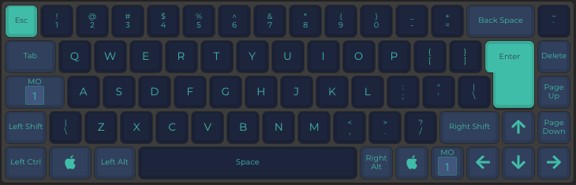
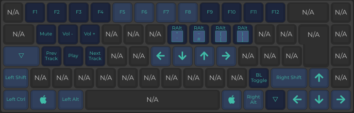

# tada68

> My custom QMK config for the tada68 ISO keyboard

*Made in [config.qmk.fm](https://config.qmk.fm)*

## Layer 0



## Layer 1



## Flash

Click the reset button on the bottom of the keyboard. Now move the binary file to the external disk. Example in macOS:

```bash
command rm -rf /Volumes/TADA68\ \ /FLASH.BIN
cp FLASH.bin /Volumes/TADA68\ \ /FLASH.BIN
```
